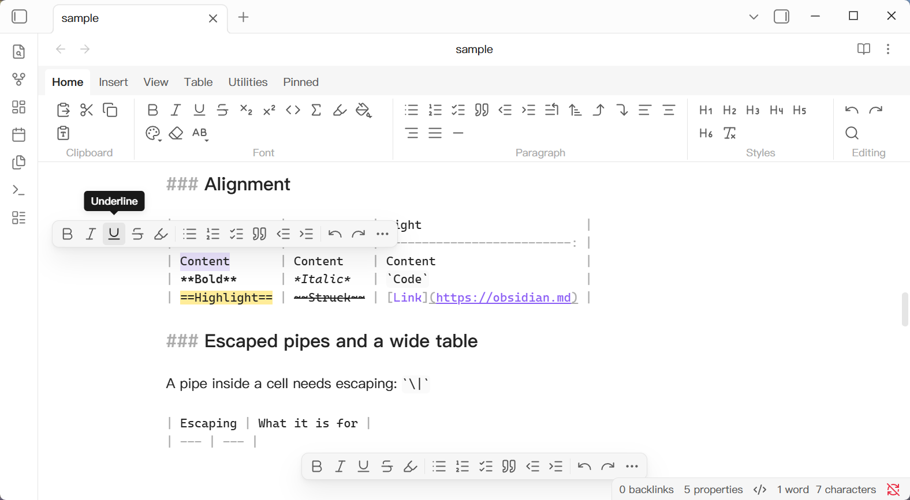

# Awesome Format Bar

Available in English, 简体中文, 繁體中文, 日本語, 한국어, Deutsch, Français and Español — follows your Obsidian language setting.

A Markdown formatting bar for [Obsidian](https://obsidian.md).

Obsidian is efficient for people fluent in Markdown, but newcomers face a syntax barrier. Awesome Format Bar overlays a Word-like toolbar on the editor, so you can apply everyday formatting by clicking a button — while your notes stay plain text. Everything it produces is standard Markdown, Obsidian Markdown, or — where Markdown falls short (Underline, Superscript, Subscript, alignment, colors) — inline HTML.

<p>
  
</p>

## Highlights

- **Three positions, freely combined** — a full **Ribbon** pinned above the editor (Top), a compact bar floating above the selection (Following), and a compact bar pinned to the bottom of the editor (Fixed). Defaults to Top.
- **78 built-in commands** across 5 tabs — Home, Insert, View, Table and Utilities — using Word terminology you already know.
- **Emoji & Symbols** — a searchable, offline panel of about 2,150 emoji, kaomoji and symbols, bundled with the plugin. No network, no accounts.
- **Pinned tab** — pin _any_ command from the command palette (core commands, other plugins' commands, or this plugin's own) to the toolbar with an icon of your choice.
- **Table editing** — insert and delete rows and columns, move rows and columns, align columns, sort rows, re-format tables, and paste tab- or comma-separated text as an aligned Markdown table.
- **Zero configuration** — fixed layout that follows your active theme; only the Pinned tab is yours to arrange.

## Commands

71 of the 78 commands are registered in the command palette, so you can assign your own shortcuts. (Drop-down containers and the Emoji & Symbols panel are toolbar-only.)

### Home

- **Clipboard** — Paste, Cut, Copy, Paste as Plain Text
- **Font** — Bold, Italic, Underline, Strikethrough, Subscript, Superscript, Inline Code, Inline Math, Highlight, Highlight Color, Font Color, Clear Formatting, Change Case
- **Paragraph** — Bullet / Numbered / Task List, Quote, Decrease / Increase Indent, Renumber List, Sort Lines, Swap Line Up / Down, Align Left / Center / Right / Justify, Horizontal Rule
- **Styles** — Heading 1–6, Remove Heading
- **Editing** — Undo, Redo, Find and Replace

### Insert

Internal Link, External Link, Embed, Tag, Block Reference, Callout, Code Block, Math Block, Table, Comment, Attach File, **Emoji & Symbols**, Date and Time.

### View

**Focus Mode** collapses both sidebars; **Zen Mode** puts the note into real fullscreen.

### Table

Available whenever the cursor is inside a table: Delete Rows or Columns, Insert Rows Above, Insert Columns to the Left, Move Row Up / Down, Move Column Left / Right, Format Tables, Align Column Left / Center / Right, Sort Rows. **Paste as Table** works anywhere: it converts tab- or comma-separated clipboard text into an aligned Markdown table.

### Utilities

**Merge Lines** joins a run of lines into one; **Split Lines** breaks them at the punctuation the selection uses most.

### Emoji & Symbols

One button on **Insert · Media & Symbols** opens a panel of about 2,150 entries in three searchable sources:

| Source  | Entries (approx.) | Examples of groups                                               |
| ------- | ----------------- | ---------------------------------------------------------------- |
| Emoji   | ~1,900            | Smileys & People, Animals & Nature, Food & Drink, Objects, Flags |
| Kaomoji | ~70               | Emotion, Animal, Behavior, People, Holiday                       |
| Symbols | ~200              | Arrows, Math, Typographic, Currency, Enclosed, Dingbats          |

Picking an entry inserts the character at the caret or over the selection, as one undo step. The panel stays open so you can drop in several characters in a row, and each source keeps its own _Frequently used_ group. All data ships inside the plugin, so it works offline.

## Installation

Requires Obsidian **1.13.7 or later**.

**From Community Plugins** — Settings → Community plugins → Browse, search for _Awesome Format Bar_, install and enable.

**With BRAT** — install [BRAT](https://github.com/TfTHacker/obsidian42-brat), then run _BRAT: Add a beta plugin_ and enter this repository's URL.

**Manually** — download `main.js`, `manifest.json` and `styles.css` from a release into `<vault>/.obsidian/plugins/awesome-format-bar/`, then enable the plugin in Settings → Community plugins.

## Usage

- Toggle each position independently in **Settings → Awesome Format Bar**.
- The **Ribbon** (Top) has six tabs; the last one, **Pinned**, holds the commands you pinned yourself. When it is empty it shows a hint pointing you to Settings.
- The **Compact** bars (Following / Fixed) carry a fixed subset of commands; anything that doesn't fit collapses into the `⋯` overflow menu.
- Pin commands under **Settings → Pinned**: add (pick a command, then an icon), change the icon, drag to reorder, or delete. Pinned commands run exactly like their command-palette counterparts; if the source plugin is disabled, the button greys out but the pin is kept.

## Settings

| Section     | Contents                                                                                                                |
| ----------- | ----------------------------------------------------------------------------------------------------------------------- |
| **Toolbar** | Independent toggles for Top / Following / Fixed                                                                          |
| **Pinned**  | Your pinned commands                                                                                                    |
| **Table**   | Enter moves to the next row; pad cell width with spaces; sort on header click in Reading view (never modifies the file) |

## Development

```shell
npm install        # install dependencies
npm run dev        # build in watch mode
npm run build      # typecheck + test + production build
npm run test       # run unit tests
npm run lint       # eslint
npm run typecheck  # tsc --noEmit
npm run deploy -- /path/to/vault   # copy main.js, manifest.json, styles.css into a vault
```

The release consists of exactly three files: `main.js`, `manifest.json` and `styles.css`.

## Release

```shell
npm version patch                    # bump package.json, manifest.json, versions.json; commit and tag
git push origin main --follow-tags   # push the commit and the tag
```

`npm version` requires a clean working tree. The tag carries no `v` prefix — it has to equal the `version` in `manifest.json`, or the release workflow rejects it.

Pushing the tag runs `.github/workflows/release.yml`, which builds the plugin and opens a **draft** release with `main.js`, `manifest.json` and `styles.css` attached. Publish the draft to make the version available.
